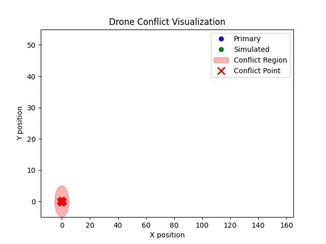

Drone Conflict Detection & Visualization
This project implements a strategic deconfliction system to verify the safety of a drone's planned mission. The system checks for potential spatio-temporal conflicts against other simulated drones in a shared airspace. This solution was developed as part of the FlytBase internship assignment.

## 1. What it does
- Reads the **primary drone** mission and **other drones** missions from JSON files.
- Calculates the position of each drone every second.
- Checks if any drone comes closer than a set **safety distance** at the **same time**.
- Prints details of the conflicts in the terminal.
- Creates an **animation** showing drone movement and marking conflict points in red.

---

## 2. Folder structure

flytbase_deconfliction/
│
├── run_deconflict.py    
│
├── requirements.txt     
├── README.md             # The project documentation file
│
├── deconflict/           # The core source code for the deconfliction system
│   ├── io.py             # Handles reading and parsing mission data
│   ├── trajectory.py     # Generates drone flight paths
│   ├── detector.py       # Implements the conflict-checking logic
│   ├── visualizer.py     # Creates the 4D animation and plots
│   └── utils.py          # (Optional) For helper functions
│
├── scenarios/            # Mission data files in JSON format
│   ├── primary.json      # Mission for the primary drone
│   └── others.json       # Missions for the simulated drones
│
├── demo/                 # Output folder for the generated animation
│   └── conflict_animation.gif
│
└── docs/                 # Project documentation and reflection files
    └── reflection.pdf    # Reflection document

3. Setup Instructions
1:Install dependencies
pip install -r requirements.txt

2:Run the simulation
python run_deconflict.py

